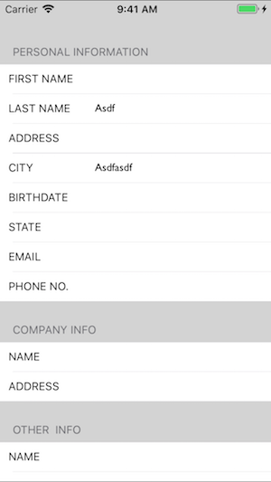

# IRDialog

Components that being used to get user information with form. 

The data model is supported by 2 NSArrays `sections` and `rows`. Inside the field the component supports:

* text : text field
* picker-date : open date picker (iPhone)
* picker-"name" : specific call for an IRPickerView
* text-email : text field with email formatted.
* text-number : text field with numberpad formatted.

This dialog has a button at the bottom. It is on the footer of the last section.

### Todo 

* Properly support iPad as well. The form is being used for serious purposed to key-in information.
* 'Next' button should appoint to the next field.
